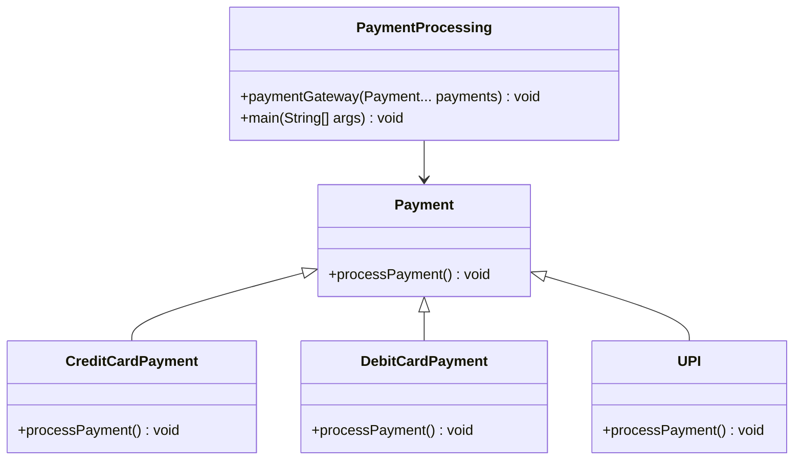

# 💳 Payment Processing System 

This project demonstrates the concepts of **Method Overriding** and **Var-args** in Java using a simple **Payment Processing System**.  

---

## 🎯 Objective
- To implement **method overriding** in Java through a payment system.
- To demonstrate **runtime polymorphism** by processing different types of payments using a common interface (`processPayment()` method).
- To show the usage of **Var-args** (`Payment... payments`) for handling multiple payments in a single transaction.

---

## 📚 Use Case
A payment gateway that supports multiple payment modes:
- Credit Card
- Debit Card
- UPI  

Instead of writing separate methods for each payment type, **polymorphism** ensures that the correct method is executed at runtime.  
The **var-args method** allows passing multiple payment objects at once, simulating a scenario where a customer processes different payments in a single transaction.

---

---

## 🖼️ UML Class Diagram

## Output 

## 📖 Conclusion

This project successfully demonstrates:

The use of Method Overriding in real-world scenarios.

The power of Polymorphism in simplifying code and enhancing flexibility.

The convenience of Var-args for handling multiple inputs dynamically.

Such a structure can be extended to real-world payment gateways where different payment methods (Credit, Debit, UPI, Wallets, etc.) are processed seamlessly.

