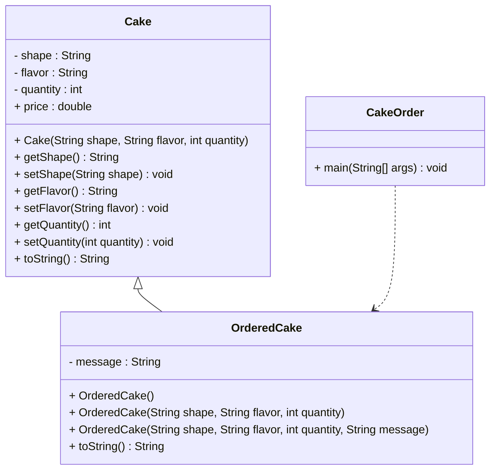

# 🍰 Cake Order Program

This project is an **abstract class and inheritance based Java program** that demonstrates how to use **abstract classes, constructors, method overriding, and inheritance** to model a cake ordering system.

---

## 📌 Assignment Requirement

You were asked to:

- Create an abstract class **Cake** with:
  - Fields: `shape`, `flavor`, `quantity`
  - Static field: `price = 400` (fixed per KG)
  - A parameterized constructor
  - Getters & setters for all fields
  - `toString()` method to display cake details

- Create a subclass **OrderedCake** that extends `Cake`:
  - Extra field: `message`
  - Constructors:
    1. **No-arg constructor** → Default values (`Round`, `Vanila`, `1 KG`, `Rs.400`)
    2. **Parameterized constructor** → Accepts `shape, flavor, quantity`
    3. **Parameterized constructor** → Accepts `shape, flavor, quantity, message`
  - Override `toString()`:
    - If message exists → Display cake details with message
    - Else → Display default cake details from superclass

- Create a main class **CakeOrder** to test the program with sample outputs.

---

---

## 🧩 Code Explanation

### 1. Abstract Class `Cake`
- Stores cake details: `shape`, `flavor`, `quantity`.
- `price` is static = **400 per KG**.
- `toString()` returns cake details with calculated price.

### 2. Subclass `OrderedCake`
- Adds an optional `message` (e.g., "Happy Birthday").
- Provides **three constructors**:
  - Default values for quick order.
  - Custom cake without message.
  - Custom cake with message.
- Overrides `toString()` to handle message display.

### 3. Main Class `CakeOrder`
- Creates objects with different constructors.
- Prints cake details to verify correctness.

---
## Sample Output

## UML Class Diagram

## Concepts Covered

Abstract class & inheritance

Constructor overloading

Method overriding

Use of static fields

Encapsulation with getters & setters

Polymorphism in toString() method
